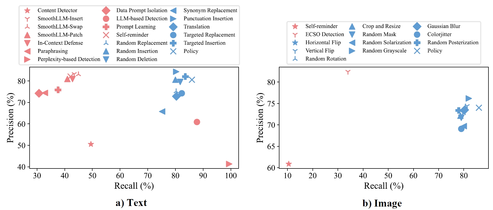

# JailGuard
## TL;DR

We proposed the first mutation-based Multi-Modal jailbreaking defense framework that supports image and text modalities.
In addition, we built the first multi-modal LLM jailbreaking attack dataset, which has 304 items of data, covering ten types of known jailbreaking attacks on image and text modalities.
The evaluation suggests that JailGuard achieves the best detection accuracy of 89.38%/85.42% on image and text inputs, outperforming state-of-the-art defense methods by 15.28%.

*Note that JailGuard is still a prototype, and we will keep improving it and our dataset.*


## Repo Structure

```
- dataset/
    - image
        - attack
        - benign
    - text                    
- JailGuard/   
    - demo_case
    - utils
    - main_img.py
    - main_txt.py
- README.md
- requirements.txt    
```

## Setup

JailGuard is implemented on Python 3.9.18.
To install all dependencies, please get into this directory and run the following command.
```
pip install requirements.txt
```

To conduct experiments on GPT-3.5(text modality), you need to add your Openai key [here](./JailGuard/utils/config.cfg).
On image, you need to clone and follow [the visual_adv repo](https://github.com/Unispac/Visual-Adversarial-Examples-Jailbreak-Large-Language-Models) to download and setup MiniGPT-4 first.
Then you need to replace the `YOUR_VISUAL_ADV_REPO` with the directory of the cloned repository and replace `YOUR_CONFIG` with your `eval_configs/minigpt4_eval.yaml` in your cloned visual_adv repo.

## Usage

JailGuard is very easy to use.
We have provided a demo, you can execute [this script](./JailGuard/main_txt.py) in the installed Python environment to experience the detection results in this [directory](./JailGuard/demo_case)


## Experiment Results

To comprehensively evaluate JailGuard, we construct the first multi-modal LLM jailbreaking attack dataset that covers ten types of jailbreak attacks on image and text modalities.
The evaluation on our dataset shows that JailGuard can effectively detect jailbreaking attacks on image and text modalities.
JailGuard has separately achieved the best detection accuracy of 89.38% and 85.42% on image and text inputs, outperforming state-of-the-art defense methods by 15.28%.
In addition, JailGuard can effectively detect and defend different types of jailbreaking attacks.
On all types of collected attacks collected, the best detection accuracy of JailGuard is always more than 70%.
By contrast, the best detection accuracy of the state-of-the-art baseline methods on any collected attacks is lower than JailGuard, and even less than 10% on `GPTsimulator` and `MasterKey-poc` attacks.
We have shared all raw experiment results(generated variants and LLM system responses) [here](https://drive.google.com/file/d/17-qioK5hFfzFkqsW33Sb6u8cjP8fb05B/view?usp=sharing).




## Reproduction

We have open-sourced our dataset [here](./JailGuard/dataset).
You can use this [script](./JailGuard/main_txt.py) to reproduce experiments on text inputs and this [script](./JailGuard/main_img.py) for image inputs.

Both scripts have 6 parameters:
1. `mutator` is used to target the mutator in defense, you can see the `help` in the scripts to find more details of its available values.
2. `path` is the path of the query under test.
3. `variant_save_dir` indicates the directory that you use to save the generated variants
4. `response_save_dir` is the directory that you use to save the LLM system responses
5. `number` is the number of generated variants and responses
6. `threshold` is the detetion threshold, default is 0.01 for GPT-3.5(text) and 0.0025 for MiniGPT-4(image)

You need to assign values for 1/2/3/4 parameters in reproduction
