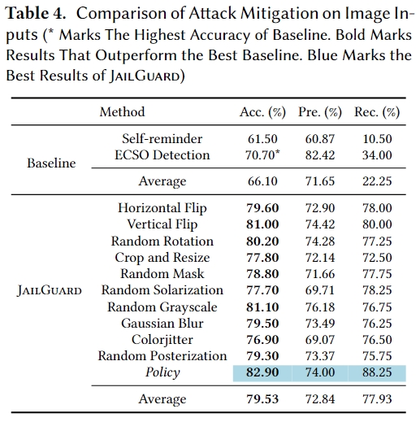
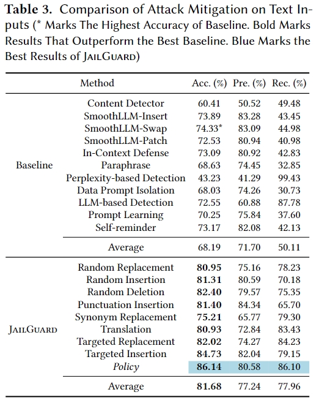

# JailGuard
## TL;DR

We design and implement a universal detection framework for
LLM prompt-based attacks, JailGuard, which effectively identifies various prompt-based attacks on both image and text modalities.
To comprehensively evaluate the detection effect of JailGuard, we construct the first comprehensive LLM prompt-based attack dataset, covering 15 jailbreaking and hijacking attacks and 11,000 items of data on image and text modalities. Our experiment results show that JailGuard achieves the best detection accuracy of 86.14%/ 82.90% on text/image inputs, significantly outperforming state-of-the-art defense methods by 11.81%-25.74% and 12.20%-21.40%.

*Note that JailGuard is still a prototype, and we will keep improving it and our dataset.*


## Repo Structure

```
- dataset/
    - image
        - dataset
        - dataset-key.pkl
    - text                    
- JailGuard/   
    - demo_case
    - utils
    - main_img.py
    - main_txt.py
- README.md
- requirements.txt    
```

## Setup

JailGuard is implemented on Python 3.9.18.
To install all dependencies, please get into this directory and run the following command.
```
pip install -r requirements.txt
```

To conduct experiments on GPT-3.5(text modality), you need to add your Openai key [here](./JailGuard/utils/config.cfg)
On image, you need to follow [this repo](https://github.com/Unispac/Visual-Adversarial-Examples-Jailbreak-Large-Language-Models) to download and setup MiniGPT-4 first (e.g., [Minigpt-4 config](./JailGuard/utils/minigpt4_eval.yaml)).
Then 

## Usage

JailGuard is very easy to use.
We have provided a demo, you can execute [this script](./JailGuard/main_txt.py) in the installed Python environment to experience the detection results in this [directory](./JailGuard/demo_case)


## Experiment Results

To comprehensively evaluate JailGuard, we construct the first comprehensive LLM prompt-based attack dataset that contains 11,000 items of data covering 15 types of jailbreaking and hijacking attacks on image and text modalities.
Based on this dataset, we conduct large-scale experiments that spend over 500M paid tokens to compare JailGuard with 12 state-of-the-art (SOTA) jailbreak and injection-based hijacking detection methods on text and image inputs.
The experimental results indicate that all mutators in JailGuard can effectively identify LLM prompt-based attacks and benign samples on image and text modalities, achieving higher detection accuracy than SOTA.
In addition, the default combination policy of JailGuard further improves the detection results and has separately achieved the best accuracy of 86.14% and 82.90% on text and image inputs, significantly outperforming state-of-the-art defense methods by 11.81%-25.74% and 12.20%-21.40%.
In addition, JailGuard can effectively detect and defend different types of jailbreaking attacks. Among all types of collected attacks, the best detection accuracy in JailGuard ranges from 77% to 100%.
The combination policy in JailGuard can achieve an accuracy of more than 70% on 10 types of text attacks, and the detection accuracy on benign samples is over 80%, which exhibits the best generalization among all mutators and baselines.





## Reproduction

We have open-sourced our dataset [here](./JailGuard/dataset), you can directly download them by [this link](https://drive.google.com/file/d/1g3VWteNnSvdayuntfL7Dd838PlRpg7B9/view?usp=sharing).

You can use this [script](./JailGuard/main_txt.py) to reproduce experiments on text inputs and this [script](./JailGuard/main_img.py) for image inputs.

Both scripts have 6 parameters:
1. `mutator` is used to target the mutator in defense, you can see the `help` in the scripts to find more details of its available values. The default one is our combination policy, which achieves the best detection results across various attacks.
2. `serial_num` is the serial number of the data under testing. For text dataset, it should be in [0,9999], for image dataset, it should be in [0,999].
3. `variant_save_dir` indicates the directory that you use to save the generated variants
4. `response_save_dir` is the directory that you use to save the LLM system responses
5. `path` is the path of the dataset/data under test.
6. `number` is the number of generated variants (LLM query budgets)
7. `threshold` is the detetion threshold, default is 0.02 for GPT-3.5(text) and 0.025 for MiniGPT-4(image)

You need to assign values for 1/2/3/4 parameters in reproduction
